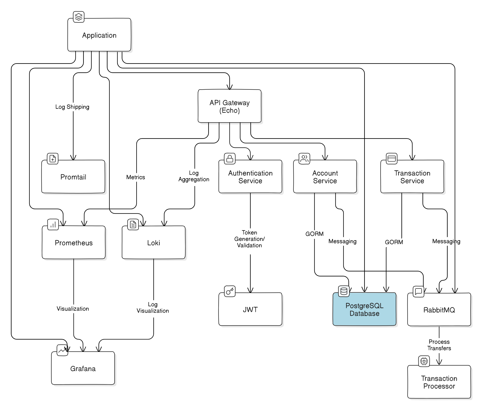

# FastBank API

A high-performance, secure banking API built with Go, featuring real-time transactions and advanced monitoring.

## 🚀 Key Features

- **Instant Account Creation**: Streamlined onboarding with secure password hashing.
- **Real-time Fund Transfers**: Asynchronous processing via RabbitMQ for high throughput.
- **Robust Security**: JWT authentication and bcrypt password encryption.
- **Advanced Monitoring**: Prometheus integration for real-time performance metrics.
- **Scalable Architecture**: Microservices-ready with Docker containerization.
- **Comprehensive Logging**: Colorized logs for enhanced debugging and traceability.

## 🏗️ Architecture

Our architecture ensures high availability, fault tolerance, and easy scalability.

## 🛠️ Tech Stack

- **Backend**: Go with Echo framework
- **Database**: PostgreSQL for ACID-compliant transactions
- **Message Queue**: RabbitMQ for asynchronous operations
- **Monitoring**: Prometheus & Grafana dashboard and loki for logs
- **Containerization**: Docker & Docker Compose

## 🚦 API Endpoints

- `POST /account`: Create new account
- `GET /account`: List accounts (Auth required)
- `POST /transfer/:accno`: Execute fund transfer (Auth required)
- `GET /transfer/:id`: Check transfer status (Auth required)

## 🚀 Quick Start

1. Clone the repo
2. Run `make dcub` to launch the entire stack
3. Visit `http://localhost:8080` to start banking!

## 📊 Monitoring & Logging

- Access Prometheus metrics at `/metrics`
- View colorized logs for real-time system insights

## 🛡️ Security Features

- Bcrypt hashing for passwords
- JWT-based API authentication
- HTTPS support for production environments

## 🧪 Development & Testing

- `make run`: Launch API locally
- `make test`: Run test suite
- `make dbinit`: Set up PostgreSQL
- `make mqinit`: Initialize RabbitMQ

## 🐳 Docker Commands

- `make docker-build`: Build FastBank image
- `make dcu`: Spin up all services
- `make dcd`: Tear down the stack

## 🤝 Contributing

We welcome contributions! Please check our contribution guidelines before submitting PRs.

## 📄 License

FastBank API is MIT licensed.
