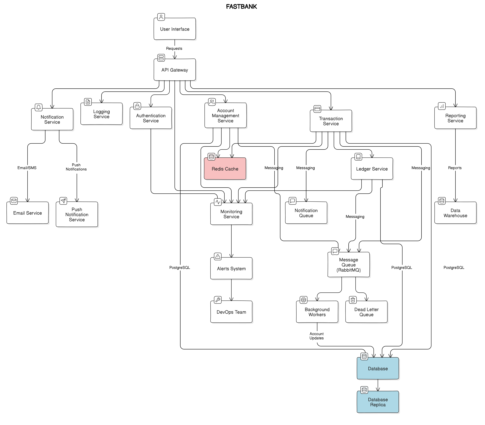

# FastBank API

(readme might be outdated as features are being added at lightspeed will update it asap)
A lightweight, secure Golang bank API with JWT authentication and PostgreSQL.

## Description

FastBank API implements a basic banking system using Go and echo. It provides essential operations such as account creation, balance inquiries, and fund transfers. The API uses JWT for secure authentication and PostgreSQL for persistent data storage. Designed with simplicity and security in mind, it serves as an excellent starting point for building more complex financial applications or learning about API development in Go. 

## Features

- Account creation and management
- Balance transfers
- JWT-based authentication
- PostgreSQL database integration

## Prerequisites

- Go
- Docker
- Make 

## Quick Start

1. `make dbinit` to init a pgsql db instance in docker
2. `make run` to start app on `http://localhost:8080`
3. Use Httpie or Postman to test the API

## Makefile Commands

- `make build`: Compile the application
- `make run`: Run the compiled application
- `make test`: Run all tests
- `make dbinit`: Initialize PostgreSQL database using Docker

## API Endpoints

- POST `/account`: Create a new account
- GET `/account`: List all accounts
- GET `/account/:id`: Get account details
- POST `/login`: Authenticate and receive JWT
- POST `/transfer/:AccNo`: Transfer funds (requires JWT)

## Usage

1. Create an account
2. Login to receive JWT
3. Use JWT in Authorization header for protected routes

## Security

- Passwords are hashed
- JWT used for API authentication
- HTTPS recommended for production use

## (SUPPOSED DESIGN)

## Contributing

Pull requests are welcome. For major changes, please open an issue first.
